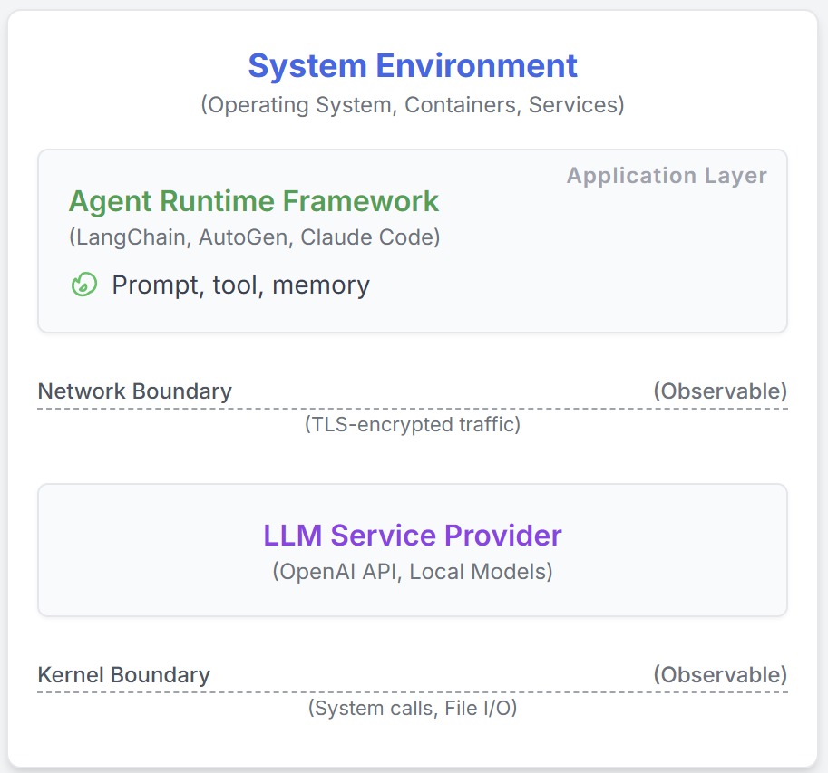

# AgentSight: 使用 eBPF 实现 AI Agent 的系统级可观测性

现代软件基础设施越来越依赖 LLM 智能体进行开发和维护，例如 Claude Code 和 Gemini-cli。然而，这些 AI 智能体与传统的确定性软件有着根本性的差异，给传统的监控和调试带来了重大挑战。这造成了一个关键的语义鸿沟：现有工具要么观察智能体的高层意图（通过 LLM 提示词），要么观察其低层动作（如系统调用），但无法将这两种视图关联起来。这种盲区使得难以区分良性操作、恶意攻击和代价高昂的故障。我们介绍 AgentSight，这是一个使用混合方法弥合语义鸿沟的可观测性框架。我们的方法，*边界追踪*，使用 eBPF 在稳定的系统接口处从应用程序代码外部监控智能体。AgentSight 拦截 TLS 加密的 LLM 流量以提取语义意图，监控内核事件以观察系统范围的影响，并使用实时引擎和辅助 LLM 分析在进程边界之间因果关联这两个流。这种无需插桩的技术与框架无关，能够适应快速的 API 变化，性能开销低于 3%。我们的评估表明，AgentSight 可以检测提示注入攻击，识别资源浪费的推理循环，并揭示多智能体系统中隐藏的协调瓶颈。AgentSight 作为开源项目发布在 https://github.com/agent-sight/agentsight。

## 引言

机器学习在系统中的角色正在经历根本性转变，从优化明确定义的任务（如数据库查询规划）转向一种新的*智能体计算*范式。从系统角度来看，AI 智能体将大型语言模型（LLM）的推理能力与对系统工具的直接访问相结合，赋予其执行诸如生成进程、修改文件系统和执行命令等操作的能力。这项技术正在快速集成到生产环境中，为自主开发工具提供动力，如 [claude code](https://www.anthropic.com/news/claude-code)、[cursor agent](https://cursor.com/) 和 [gemini-cli](https://blog.google/technology/developers/introducing-gemini-cli-open-source-ai-agent/)，它们可以独立处理复杂的软件工程和系统维护任务。本质上，我们正在部署非确定性的 ML 系统，为系统可靠性、安全性和验证创造了前所未有的挑战。

这种范式转变创造了一个关键的语义鸿沟：智能体高层*意图*与其低层*系统动作*之间的鸿沟。与具有可预测执行路径的传统程序不同，智能体使用 LLM 和自主工具动态生成代码并生成任意子进程。这使得现有的可观测性工具难以区分良性操作和灾难性故障。考虑一个负责代码重构的智能体，由于从搜索 API 文档时外部 URL 的搜索结果中读取了恶意提示，反而注入了后门（[间接提示注入](https://arxiv.org/abs/2403.02691)）。应用层监控器可能看到一个成功的"执行脚本"工具调用，而系统监控器看到一个 `bash` 进程写入文件。两者都无法弥合鸿沟来理解良性意图已被扭曲为恶意行为，使它们实际上处于盲目状态。

当前的方法被困在语义鸿沟的一侧。*应用层插桩*，如 [LangChain](https://github.com/langchain-ai/langchain) 和 [AutoGen](https://github.com/microsoft/autogen) 等框架中所见，捕获智能体的推理和工具选择。虽然这些工具看到了*意图*，但它们很脆弱，需要不断的 API 更新，并且很容易被绕过：一个简单的 shell 命令就能逃离它们的视野，在有缺陷的信任模型下打破可见性链。相反，*通用系统级监控*看到了*动作*，跟踪每个系统调用和文件访问。然而，它缺乏所有语义上下文。对于这样的工具，编写数据分析脚本的智能体与编写恶意载荷的受损智能体无法区分。如果不理解之前的 LLM 指令，即*为什么*背后的*什么*，其低层事件流就是无意义的噪声。

我们提出边界追踪作为一种专门设计用于弥合这一语义鸿沟的新型可观测性方法。我们的关键洞察是，虽然智能体内部和框架是不稳定的，但它们与世界交互的接口（系统操作的内核和通信的网络）是稳定且不可避免的。通过在这些边界外部的应用程序进行监控，我们可以捕获智能体的高层意图及其低层系统效果。我们介绍 **AgentSight**，一个使用 eBPF 实现边界追踪的系统，用于拦截 TLS 加密的 LLM 流量以获取意图，并监控内核事件以获取效果。其核心是一个新颖的两阶段关联过程：实时引擎将 LLM 响应链接到它触发的系统行为，辅助"观察者"LLM 对生成的追踪执行深度语义分析，以推断风险并解释*为什么*事件序列是可疑的。这种无需插桩、与框架无关的技术产生的开销低于 3%，并有效检测提示注入攻击、资源浪费的推理循环和多智能体系统瓶颈。

## 背景与相关工作

本节概述 LLM 智能体架构，回顾现有的可观测性工作以突出语义鸿沟，并介绍 eBPF 作为我们的基础技术。

### LLM 智能体架构

引言中描述的智能体系统通常使用一种通用架构实现。这些系统由三个核心组件组成：（1）用于推理的 LLM 后端，（2）用于系统交互的工具执行框架，以及（3）协调提示、工具调用和状态管理的控制循环。流行的框架如 [LangChain](https://github.com/langchain-ai/langchain)、[AutoGen](https://github.com/microsoft/autogen)、[cursor agent](https://cursor.com/)、[gemini-cli](https://blog.google/technology/developers/introducing-gemini-cli-open-source-ai-agent/) 和 [Claude Code](https://www.anthropic.com/news/claude-code) 都实现了这个模型的变体。这种架构使智能体能够基于高层自然语言目标动态构建和执行复杂计划（例如，自主编写和运行脚本来分析数据集）。

### LLM 智能体的可观测性

现有方法被孤立在语义鸿沟的一侧。意图侧可观测性，由 Langfuse、LangSmith 和 Datadog 等行业工具支持，并通过 OpenTelemetry GenAI 工作组的标准和学术界在 AgentOps 概念下的概念分类法进行统一，擅长追踪应用层事件，但对进程外系统*动作*根本上是盲目的。相反，使用 Falco 和 Tracee 等工具的动作侧可观测性提供了对系统调用的全面可见性，但缺乏理解智能体*意图*的语义上下文，无法区分良性任务和恶意任务。对推理级别和可解释性的并行研究旨在通过重建认知追踪或启用解释性对话使智能体的内部思维过程更加透明，但这些工作主要关注 LLM 本身，没有弥合智能体内部推理与其对系统的外部低层影响之间的鸿沟。

### 扩展伯克利包过滤器（eBPF）

为了弥合语义鸿沟，我们的方法需要一种能够安全高效地观察网络通信和内核活动的技术。eBPF（扩展伯克利包过滤器）是内核可编程性的根本性进步，恰好提供了这种能力。最初设计用于包过滤，eBPF 已发展成为一个通用的内核虚拟机，为现代可观测性和安全工具提供动力。对于 AI 智能体可观测性，eBPF 具有独特的适用性，因为它允许在智能体与世界交互的确切边界处进行观察，以最小的开销实现语义*意图*的 TLS 拦截和系统*动作*的系统调用监控。关键的是，其内核强制的安全保证，包括经过验证的终止和内存安全，使其成为生产环境的理想选择，并为我们的解决方案提供了稳定的基础。

## 设计

AgentSight 的设计遵循一个单一的指导原则：弥合智能体意图与其动作之间的语义鸿沟。我们通过一种新颖的可观测性方法——边界追踪，通过多信号关联引擎实现这一目标。

### 边界追踪：一种原则性方法

我们的关键洞察是，所有智能体交互必须穿越明确定义且稳定的系统边界：系统操作的内核和与 LLM 服务后端外部通信的网络（图 1）。通过在这些边界而不是在不稳定的智能体代码内进行监控，我们实现了独立于实现细节的全面监控。这种方法实现了语义关联，即能够因果地将高层意图与低层系统事件联系起来。这得到两个原则的支持。首先是全面性，因为内核级监控确保从进程创建到文件 I/O 的任何系统动作都不会被忽视，即使跨越生成的子进程。其次是稳定性，因为系统调用 ABI 和网络协议的演变速度远慢于智能体框架，提供了一个持久的、面向未来的解决方案。这种范式将信任模型从假设合作的智能体转变为在防篡改边界处强制观察。

*图 1：智能体框架概览*

### 系统架构：观察边界

AgentSight 的架构同时利用两个关键边界。如图 2 所示，我们使用 eBPF 放置非侵入式探针，从用户空间 SSL 函数捕获解密的意图流（LLM 提示/响应），从内核捕获动作流（系统调用、进程事件）。然后用户空间关联引擎处理并将这些流连接成统一的、因果链接的追踪。

*图 2：AgentSight 系统架构*

几个关键组件使 AgentSight 能够有效地弥合语义鸿沟：

**用于安全、统一探测的 eBPF：** 我们选择 eBPF 是因为其生产安全性、高性能以及统一访问用户空间和内核数据流的能力。我们的设计从智能体与 LLM 服务后端的交互中拦截解密的数据，这比网络级包捕获或基于代理的解决方案更高效且更易管理。

**多信号因果关联引擎：** 我们设计的核心是一个在意图和动作之间建立因果关系的关联策略。我们设计了一个依赖三个关键机制的多信号引擎：进程谱系，通过跟踪 `fork` 和 `execve` 事件构建完整的进程树，将子进程中的动作链接回父智能体；时间邻近性，将 LLM 响应后立即在狭窄时间窗口内发生的动作关联起来；参数匹配，将 LLM 响应中的内容（如文件名、URL 或命令）与后续系统调用的参数直接匹配。这些信号共同使 AgentSight 能够在进程边界之间明确建立高层意图与低层系统操作之间的因果关系。

**LLM 驱动的语义分析：** 为了超越脆弱的基于规则的检测，我们设计系统使用辅助 LLM 作为推理引擎。通过使用关联的事件追踪提示强大的模型，我们利用其理解语义细微差别、推断复杂场景中的因果关系以及用自然语言总结发现的能力。这种"AI 监视 AI"的方法使 AgentSight 能够检测不匹配预定义模式的威胁。

## 实现

AgentSight 实现为一个用户空间守护程序（6000 行 Rust/C）协调 eBPF 程序，带有用于分析的 TypeScript 前端（3000 行）。它设计用于高性能，将原始内核事件流处理成关联的、人类可读的数据。

### 在边界处收集数据

我们的 eBPF 探针从系统捕获原始的意图和动作流。为了捕获语义意图，带有 uprobes 的 eBPF 程序附加到 OpenSSL 等加密库中的 SSL_read/SSL_write，以拦截解密的 LLM 通信。我们的用户空间守护程序实现了一个有状态的重组机制来处理服务器发送事件（SSE）等流协议。为了捕获系统动作，第二个 eBPF 程序使用稳定的追踪点（如 sched_process_exec）来构建进程树，并使用 kprobes 动态监控相关的系统调用，如 openat2、connect 和 execve。为了在不丢失数据的情况下管理大量内核事件，应用了激进的内核内过滤，确保只有来自目标智能体进程的事件被发送到用户空间，最大限度地减少开销。

### 混合关联引擎

基于 Rust 的用户空间守护程序包含我们的两阶段关联引擎。第一阶段从 eBPF 环形缓冲区消费事件并执行实时启发式链接。这个流处理管道用上下文丰富原始事件，如将文件描述符映射到完整路径，维护有状态的进程树，并应用我们设计中描述的因果链接逻辑，使用 100-500 毫秒的时间窗口进行时间关联。一旦构建了连贯的追踪，第二阶段将其格式化为结构化日志以进行语义分析。此日志用于为辅助 LLM 构建详细的提示，指示其充当安全分析师。LLM 的自然语言分析和置信度分数成为我们系统的最终输出。这个阶段的一个关键挑战是管理 LLM 分析的延迟和成本，我们的系统通过异步处理和强大的提示工程来缓解这一问题。

## 评估

我们的评估由两个研究问题指导：首先，AgentSight 在实际工作流中的性能开销是多少？其次，它在检测关键安全威胁和性能病理方面有多有效地弥合语义鸿沟，同时还能揭示多智能体系统中的复杂动态？

### 性能评估

我们在服务器（Ubuntu 22.04，Linux 6.14.0）上使用 Claude Code 1.0.62 作为测试智能体评估了 AgentSight。基准测试侧重于使用[教程仓库](https://github.com/eunomia-bpf/bpf-developer-tutorial)的三个真实世界开发工作流：使用 `/init` 命令理解仓库、为 bpftrace 脚本生成代码以及使用并行构建进行完整的仓库编译。每个实验在有和没有 AgentSight 的情况下运行 3 次以测量运行时开销。

| 任务 | 基准线 (秒) | AgentSight (秒) | 开销 |
|------|--------------|----------------|----------|
| 理解仓库 | 127.98 | 132.33 | 3.4% |
| 代码编写 | 22.54 | 23.64 | 4.9% |
| 仓库编译 | 92.40 | 92.72 | 0.4% |

*表 1：AgentSight 引入的开销*

表 1 量化了 AgentSight 在三个开发工作流中的运行时开销，平均开销为 2.9%。

### 案例研究

我们通过案例研究评估了 AgentSight 的有效性，展示了其检测安全威胁、识别性能问题以及提供对复杂多智能体系统见解的能力。

#### 案例研究 1：检测提示注入攻击

我们测试了 AgentSight 检测[间接提示注入攻击](https://arxiv.org/abs/2403.02691)的能力。在我们的测试中，数据分析智能体收到了一个精心制作的提示，在合法请求中嵌入了恶意命令，最终导致它泄露 `/etc/passwd`。AgentSight 捕获了完整的攻击链：从初始 LLM 与可疑网页的交互到最终的敏感文件读取，包括中间的子进程生成和出站连接。关联的事件追踪被传递给我们的观察者 LLM 进行分析，返回了高置信度的攻击分数（5/5）。LLM 的分析得出结论，智能体的动作——执行 shell 命令读取 `/etc/passwd` 并连接到非公司域名——与其声明的"分析销售数据"目标在逻辑上不一致，识别出成功提示注入的经典数据泄露模式。这展示了结合意图和动作如何提供可操作的、上下文感知的检测。

#### 案例研究 2：推理循环检测

尝试复杂任务的智能体由于常见的工具使用错误而进入无限循环。它反复使用错误的参数调用命令行工具，收到错误，但随后未能纠正其错误，重试完全相同的失败命令。AgentSight 的实时监控器从 12 个 API 调用的追踪中检测到这种异常的资源消耗，并将其传递给观察者 LLM。LLM 将根本原因识别为持续的工具错误，注意到智能体陷入了"尝试-失败-重新推理"循环；它执行相同的失败命令，将相同的错误传回推理 LLM，并未能从工具的输出中学习。系统在三个完整周期后触发了警报（可配置的阈值），此时智能体已经消耗了 4,800 个令牌。这种干预防止了进一步的资源浪费和服务降级，节省了约 2.40 美元的 API 成本，并突出了语义感知监控的重要性。

#### 案例研究 3：多智能体协调监控

AgentSight 监控了三个协作软件开发智能体的团队，捕获了总共 12,847 个事件。例如，智能体 B 有 34% 的总时钟时间被阻塞，等待智能体 A 的多次设计修订，这触发了级联的返工。智能体 B 的实现与智能体 C 的测试之间的文件锁定争用导致了 23 个重试周期。分析表明，虽然智能体开发了一些紧急协调，但显式机制可以在此工作负载上减少高达 25% 的总运行时间，基于消息的通信可以消除大部分轮询开销。这揭示了边界追踪如何独特地捕获应用层监控无法跨进程边界观察的多智能体系统动态。

## 结论

本文介绍了 AgentSight，使用新颖的*边界追踪*方法弥合 AI 智能体意图与其系统级动作之间的关键语义鸿沟。通过利用 eBPF，系统无需插桩即可监控网络和内核事件，通过混合关联引擎将 LLM 通信因果地链接到其系统范围的影响。我们的评估表明，AgentSight 有效检测提示注入攻击、推理循环和多智能体瓶颈，性能开销低于 3%。这种"AI 监视 AI"为日益自主的 AI 系统的安全和可靠部署提供了基础方法论。

---

## 参考文献

1. **claudecode**: Anthropic. "Introducing Claude Code." Anthropic Blog, Feb 2025. https://www.anthropic.com/news/claude-code

2. **cursor**: Anysphere Inc. "Cursor: The AI‑powered Code Editor." 2025. https://cursor.com/

3. **geminicli**: Mullen, T., Salva, R.J. "Gemini CLI: Your Open‑Source AI Agent." Google Developers Blog, Jun 2025. https://blog.google/technology/developers/introducing-gemini-cli-open-source-ai-agent/

4. **indirect-prompt-inject**: Zhan, Q., Liang, Z., Ying, Z., Kang, D. "InjecAgent: Benchmarking Indirect Prompt Injections in Tool-Integrated Large Language Model Agents." ACL Findings, 2024. https://arxiv.org/abs/2403.02691

5. **langchain**: Chase, H. "LangChain: Building applications with LLMs through composability." 2023. https://github.com/langchain-ai/langchain

6. **autogen**: Wu, Q., et al. "AutoGen: Enable Next-Gen Large Language Model Applications." Microsoft Research, 2023. https://github.com/microsoft/autogen

7. **Maierhofer2025Langfuse**: Maierhöfer, J. "AI Agent Observability with Langfuse." Langfuse Blog, March 16, 2025. https://langfuse.com/blog/2024-07-ai-agent-observability-with-langfuse

8. **langfuse**: "Langfuse - LLM Observability & Application Tracing." 2024. https://langfuse.com/

9. **langsmith**: LangChain. "Observability Quick Start - LangSmith." 2023. https://docs.smith.langchain.com/observability

10. **Datadog2023Agents**: Datadog Inc. "Monitor, troubleshoot, and improve AI agents with Datadog." Datadog Blog, 2023. https://www.datadoghq.com/blog/monitor-ai-agents/

11. **helicone**: "Helicone / LLM-Observability for Developers." 2023. https://www.helicone.ai/

12. **Liu2025OTel**: Liu, G., Solomon, S. "AI Agent Observability -- Evolving Standards and Best Practices." OpenTelemetry Blog, March 6, 2025. https://opentelemetry.io/blog/2025/ai-agent-observability/

13. **Bandurchin2025Uptrace**: Bandurchin, A. "AI Agent Observability Explained: Key Concepts and Standards." Uptrace Blog, April 16, 2025. https://uptrace.dev/blog/ai-agent-observability

14. **Dong2024AgentOps**: Dong, L., Lu, Q., Zhu, L. "AgentOps: Enabling Observability of LLM Agents." arXiv preprint arXiv:2411.05285, 2024.

15. **Moshkovich2025Pipeline**: Moshkovich, D., Zeltyn, S. "Taming Uncertainty via Automation: Observing, Analyzing, and Optimizing Agentic AI Systems." arXiv preprint arXiv:2507.11277, 2025.

16. **falco**: The Falco Authors. "Falco: Cloud Native Runtime Security." 2023. https://falco.org/

17. **tracee**: Aqua Security. "Tracee: Runtime Security and Forensics using eBPF." 2023. https://github.com/aquasecurity/tracee

18. **Rombaut2025Watson**: Rombaut, B., et al. "Watson: A Cognitive Observability Framework for the Reasoning of LLM-Powered Agents." arXiv preprint arXiv:2411.03455, 2025.

19. **Kim2025AgenticInterp**: Kim, B., et al. "Because we have LLMs, we Can and Should Pursue Agentic Interpretability." arXiv preprint arXiv:2506.12152, 2025.

20. **brendangregg**: Gregg, B. "BPF Performance Tools." Addison-Wesley Professional, 2019.

21. **ebpfio**: eBPF Community. "eBPF Documentation." 2023. https://ebpf.io/

22. **cilium**: Cilium Project. "eBPF-based Networking, Observability, and Security." 2023. https://cilium.io/

23. **kerneldoc**: Linux Kernel Community. "BPF Documentation - The Linux Kernel." 2023. https://www.kernel.org/doc/html/latest/bpf/

24. **ebpftutorial**: eunomia-bpf. "eBPF Developer Tutorial." GitHub, 2024. https://github.com/eunomia-bpf/bpf-developer-tutorial

---

**仓库**: https://github.com/eunomia-bpf/agentsight
